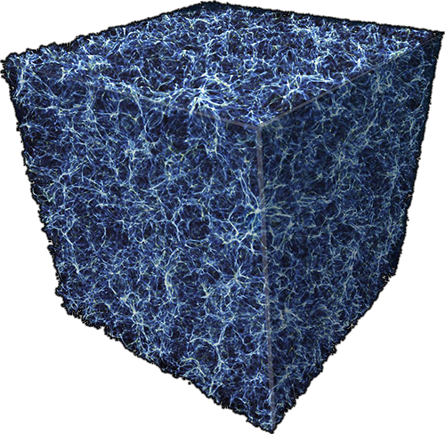
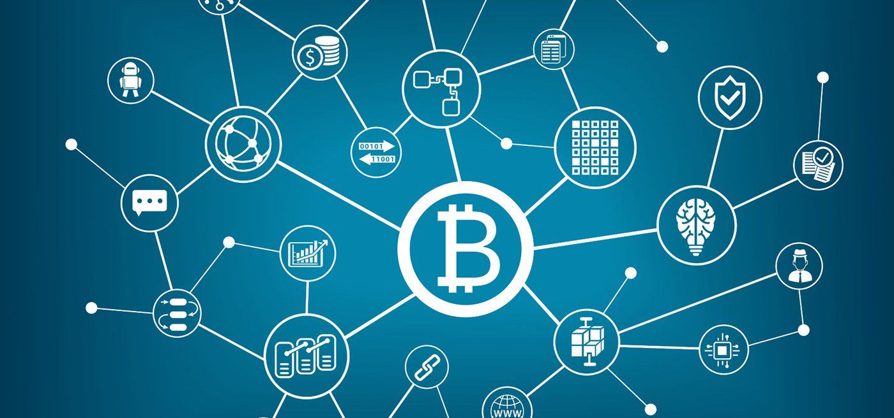
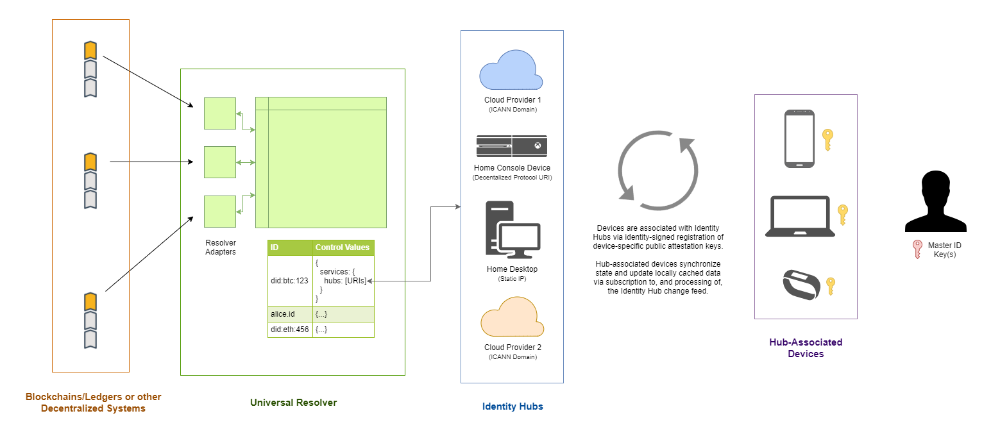

Defining identity is a notoriously difficult endeavor. Identity, in the technology industry, is the name of a business vertical that developers and software vendors use to describe a class of products and services they employ for managing users, authentication, and access control. But the average person doesn't define identity in this way. They're more likely to describe identity as how a person or thing defines itself and is known to the world around it. I have always thought it ironic that an industry vertical named 'Identity' rarely produces solutions that extend beyond a narrow sliver of what identity truly is. In this post, I will present a conceptual model for identity that defines it as an expansive, organic system, and my stretch goal is that it changes how you perceive your interactions in the world (at least a little).

## Identity as a Cosmological Analog

According to Dark Matter & Energy theory, the atoms, particles, and energy people commonly believe are the sum total of the universe, is known as Baryonic matter. Interestingly, and in contrast with human perception, the theory postulates that this form of matter only makes up ~5% of total matter and energy in the universe. The vast majority of the universe is said to be composed of another form of matter and energy, Dark Matter and Dark Energy. I find it fascinating there can be so much beyond our perception that goes into producing the relatively tiny sliver of what we recognize as our world.

NASA, ESA, and E. Hallman (University of Colorado, Boulder)

I posit to you that your perception of the countless interactions and exchanges you participate in on a daily basis is the Baryonic equivalent of their true scope and depth - just 5% of what's really happening. The 95% you don't see - the organic, interconnected web that permeates everything you experience - is identity. In this way, identity can be described as the Dark Matter & Energy of our physical and digital lives.

## Identity Transactions All Around Us

Every object on the planet (alive or inanimate) is a distinct entity, each with its own identity - this includes humans, organizations, devices, bots, VR objects, and countless other nouns. But the rabbit’s hole goes much deeper: this swirl of identities is constantly interacting with each other in ways you probably don't recognize as identity transactions. What these identities generate, exchange, and experience during their interactions are transfers of identity-encoded data that augment their state, definition, and accrued provenance.

All identity interactions are generally based on the transfer of self-signed or multi-party proofs; *attestations*, as many in the industry refer to them. These identity-linked proofs are what form the basis of trust and auditability when interacting with other identities.

Here are just a few examples of identity transactions in our world: - **Text, vocal, or visual communications** - identity-encoded message transmissions
- **Licenses, permits, certificates, etc.** - identity-signed declarations of privilege
- **Blogs, reviews, comments, etc.** - self-signed attestations about other identities
- **Music, paintings, novels, photos. etc.** - identity-encoded asset authorship proofs
- **Sales, ads, bids, asks, etc.** - identity-signed signals of offer or intent
- **Supply chains, ownership histories, etc.** - a trail of identity-signed proofs

As you can see, almost everything you do in life is an identity-encoded transaction, but much like Dark Matter & Energy, they are currently difficult to capture and record. In the identity technology sphere, we lack a good technical system for processing and storing these exchanges in a way that is precise, self-sovereign, discoverable, and universally interoperable. Most of these interactions are either never recorded or are captured by a sea of apps and services that lock them in silos and walled gardens, often sharing the resulting data with unintended third-parties.

## Enter The Blockchain

We talk about identity, proofs, and signatures as the fundamental building blocks of every interaction between entities, but what technical options are best suited for this? In my early work at Mozilla, and more serious development now at Microsoft and the [Decentralized Identity Foundation](http://identity.foundation), we found that decentralized blockchains provide a solid foundation for anchoring [Decentralized Identifiers](https://w3c-ccg.github.io/did-spec/) and DPKI operations. By using decentralized blockchains as a root of trust for anchoring identifiers and their association with cryptographic keys and off-chain personal datastores, you can create a system with just the right mix of attributes and features to support these kinds of identity interactions. Here's a graphic that shows what the system looks like from a high level:

With this layered approach, most interactions are able to be done off-chain by simply signing data and [Verifiable Credentials](https://w3c.github.io/vc-data-model/) with keys that are linked to blockchain-anchored identifiers. In many cases, the time-state of these identity interactions can also be important, so the identities involved may want to create a chain-anchored proof that captures the state of what they exchanged, when they exchanged it.

### The Breathtaking Scale of Identity

Given the scope of identity, it is important to think about its scale. As alluded to above, *each* person, organization, device, bot, etc., *singularly* generates hundreds, if not thousands - and in some cases, millions - of transactions per day. Hopefully you are starting to realize the staggering scale required from any system or technology that seeks to support a world of identity transactions. The canonical scaling goal you often hear about in blockchain land is "Look Ma, I can do 3000 transactions per second, just like Visa!". While this would be a laudable goal if Visa-type payments accounted for a majority of transactional demand, it's a drop in the ocean of demand-reality - and a tsunami is coming. All other demand sources aside, identity transactions + streaming micropayments, deployed at world-scale, would reach into the trillions of transactions per day.

## *Preview of Part 2*

Blockchains, as decentralized, distributed systems that rely on broadcast transmission and consensus synchronization, are implicitly difficult to scale compared to traditional systems. Some blockchain communities have turned to what is known as on-chain scaling, versus intelligent off-loading of demand to secure, chain-anchored, Layer 2 systems. In the next post, I will break down the quantitative scale of demand blockchains will face if they intend to support decentralized identity, and provide an assessment of the various approaches to meeting that demand.