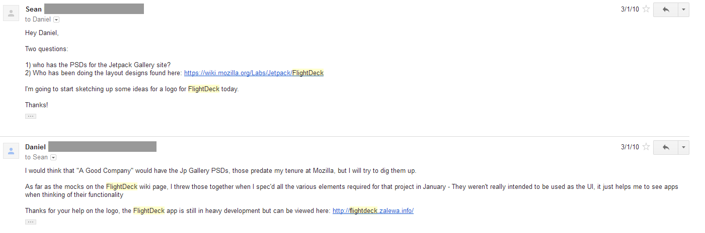
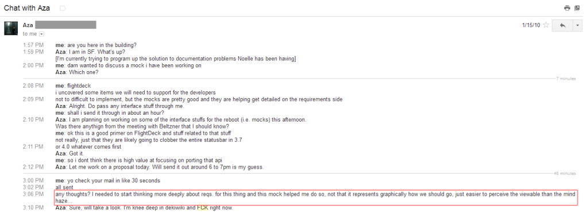
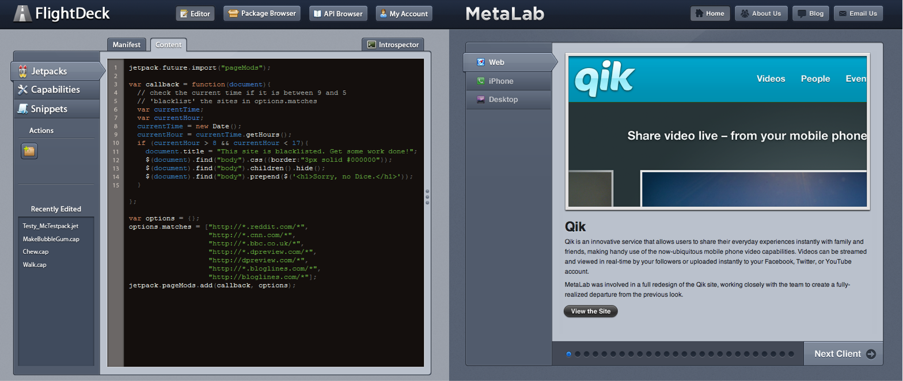
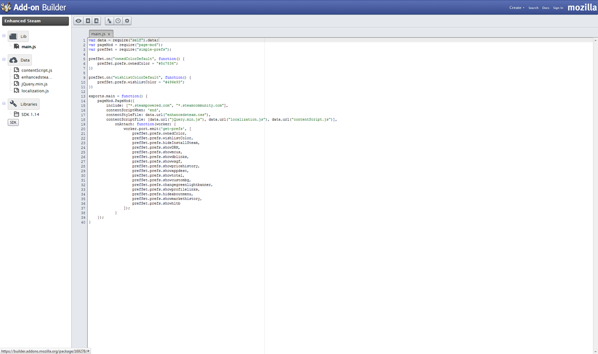
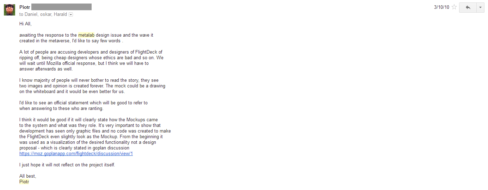
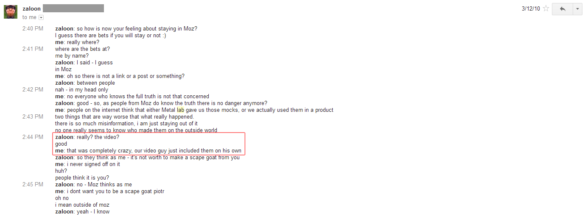

**NOTE: I spoke with Andrew Wilkinson (CEO of MetaLab) prior to releasing this post.**## The Back Story

I arrived at Mozilla 4 years ago at age of 26 with a passion for the web. Like many Mozillians, my previous job was with a private company. Mozilla was radically different than any work environment I had ever been in. Not only is Mozilla open source, it's also open meeting, open planning, open specs, open mockups, open bug lists - yeah, lots of open. I wasn't used to this, not that I shied away from openness or wanted to be secretive, it simply took a while to acclimate myself. One of the first projects I was tasked with when I arrived was [Add-on Builder](https://builder.addons.mozilla.org/). It was to be a lightweight code environment for Firefox add-ons - mostly for beginners and people who wanted to test their add-ons in a collaborative way (think jsFiddle for Firefox Add-ons). Unfortunately, it was also the source of the most frustrating, painful event of my professional career. Given Add-on Builder was end-of-life'd a few months ago to free up resources for other developer-facing products, I thought I'd finally write about the event and what *actually* happened. As it turns out, it was far less interesting than the woefully inaccurate fable it mutated into. Here goes:

## A new project, yay!

I started planning the project in document form, listing out the use-cases, what it was to be, what it shouldn't be, pretty standard stuff. As a Product Manager, the focus is on user stories, features, and product lifecycle, not the UI, color scheme, gradients, and image assets. Another thing many PMs do, is create *functional mockups* - not to be confused with *design mockups*. If you're not familiar with the difference between functional and design mockups, here's an overview: *functional mockups* are generated at an early stage to communicate what features need to be built, while *design mockups* are given to developers at a later stage so they can implement the UI, styles, image assets etc. I'm not a designer by any means, but I learned Photoshop by making posters at a previous job in college, and later used Photoshop as my tool for creating functional mockups to spec-out product features. The idea with functional mocks should be "Here team, we need these key *features*, pay no attention to the design." Soon it came time to take things beyond the documentation stages. I had seen an awesome design firm, [MetaLab](http://metalabdesign.com/ "MetaLab"), around the web before coming to work for Mozilla, and always thought it would be cool to have a product designed by them. I figured heck, this is Mozilla, maybe I'll get a design budget for the project! I was used to budgets at other companies, we had clearly defined numbers to work with before projects began. Mozilla wasn't huge on the exact dollars and cents in those days, there was a very casual project funding process (not that it is super corporate today, but we're a bit more precise now).

## It's a category 5 FUD-storm! Run!

We had our first meeting with MetaLab to discuss the project, it went really well, everyone seemed excited. After our initial contact with MetaLab, I started fiddling with functional mocks for the project. I had never used a tool like [Balsamiq](http://balsamiq.com/) or [Moqups](https://moqups.com/); I knew Photoshop, and that was my go-to. Without any malicious intent, I took a screenshot of a MetaLab web page and spec'd some of the first features we would need in Add-on Builder. I honestly didn't think anything of it because it was just a functional mock, and I figured I'd be handing them to MetaLab so they could create the real designs. In addition, the page I took a screenshot of had a narrow, center-column layout that was not what you would use for the *actual design* of a code editor. After we sent MetaLab a few more details, they generated a quote for us. The quote turned out to be much higher than my boss expected, and I was instructed to decline it. I sent MetaLab an email telling them we were not able to proceed. A couple weeks later, I stuck the first of the functional mocks on the project's wiki page. It's an open wiki, so everyone could see what we were planning and contribute. Again, I thought nothing of it, they were going to be discarded as soon as a real design was generated. A few months down the road, some random user saw the functional mocks on the project's wiki page and told MetaLab we had copied their design. From there it swelled to a category 5 FUD-storm of galactic proportion, and no one was left unpoopified.

## Breakin' it down like a fraction

Let's correct the major inaccuracies that swirled around ([blog post 1](http://blog.metalabdesign.com/post/437932602/metalab-goes-open-source), [blog post 2](http://blog.metalabdesign.com/post/440371465/the-great-mozilla-debacle), [press FUD](http://techcrunch.com/2010/03/09/metalab-accuses-mozilla-of-plagiarizing-its-design/)) by examining what actually happened, point by point: ---

**The Myth**: We stole MetaLab's design. **Reality**: The mocks were purely functional - and I reinforced this specifically, with all members of the team, on many occasions  The mocks were destined for the trash from the beginning, they were only intended to explain to developers on the team "Hey, there should be a button to press so the user can do _____." It's not shocking these are identical - I was cutting and pasting things to show *features*  Here's what was actually being designed for the product (it hasn't changed since the first line of code was committed)  ---

**The Myth**: We used MetaLab's design elements in Add-on Builder. **Reality:** Never at anytime during the entire life of the project - *including initial development and before this issue was brought to our attention* - were any code, styles, or images used in the product from any design elements, assets, colors etc. in the functional mockups  But heck, don't take my word for it, everything was done out in the open for everyone to see from day 1: [github.com/mozilla/FlightDeck](https://github.com/mozilla/FlightDeck)---

**The Myth**: We intentionally used the functional mockups to our gain. **Reality:** A single video briefly showed one of the mocks - I wasn't aware this had happened until we were notified (the video folks grabbed it from our wiki page - oh god, the wiki!)  ---

## Owning My Part

I was young and had just come from a private company where I created tons of functional mocks like this, and never did we implement a design from them. Because I was use to communicating features to a small team using functional mocks, then discarding them upon receipt of real designs, I never intended to steal anything by cutting and pasting features in a mock. I naively posted a functional mock on a public wiki that was based on a screenshot of a web site, and I could have attributed the image I cut and pasted things into regardless of its purpose or ultimate, intended destination: the trash. I was wrong, I should have thought of this stuff. I should also have fought harder to tell the outside world what really happened. Sadly, the folks in charge of our communication felt it best to refrain from communicating what actually happened with any level of detail (face-to-palm-to-desk-to-wall). After talking with Andrew from MetaLab, it's clear they were equally bewildered by the hazy communication, and unspecific apology we issued. Andrew said they have no hard feelings, and after telling them about what really happened, they were curious why we weren't more clear about it all to begin with. Next time I will be more assertive about what needs to be communicated - letting inaccuracies float around in the press and on blogs to live forevermore did no one any favors.

## Why write about it now?

The weeks that came after this craziness were really tough. Sites, blogs, and press were saying hurtful things (based on myths I was told *not to correct*), and the looks I got made me want to permanently work from home. I never felt so vulnerable in my professional life - which is ironic, because my co-workers had nicknamed me "Tenacious D". It rarely, if ever, comes up these days, but it has always frustrated me that the record was never corrected - I just got tired of that. Sometimes it's hard not to look back when you don't definitively put the past to bed.