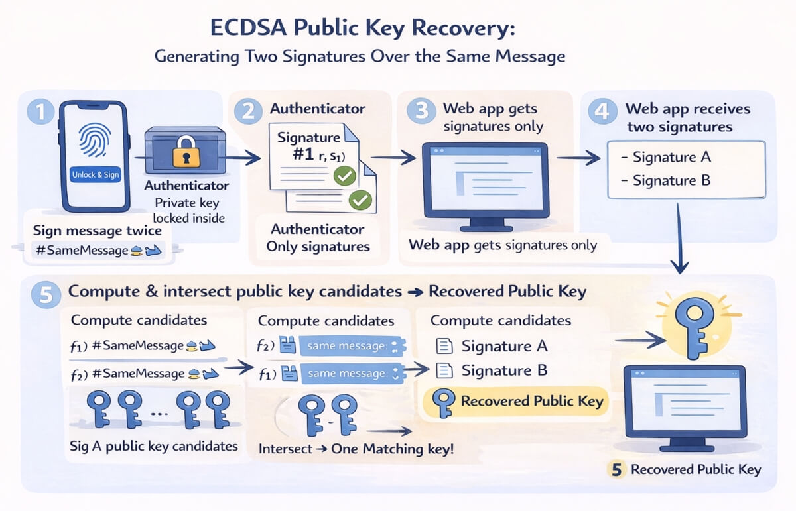
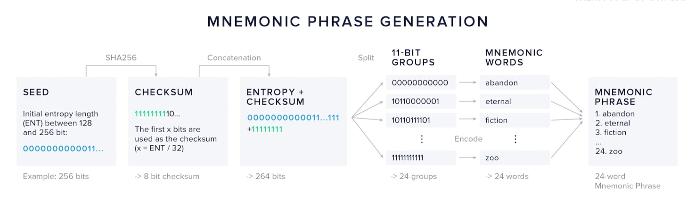

When I was at Microsoft, I worked on the team responsible for the development and standardization of Passkeys. [Passkeys](https://www.passkeys.io/) have made standard, secure, cryptographic authentication [accessible to all users](https://www.passkeys.io/who-supports-passkeys), but the Passkey model is largely restricted to the website/app login use case.

PassSeeds is a hack that explores this question: can we hijack the capabilties and user experience of Passkeys to apply it to use cases that strech beyond its rigid model and limited key type support, where the status quo is often users pasting key material into sites/apps, or buying special hardware devices that can be difficult for less technical folks to deal with?

Even with a deep, code-level understanding of Passkeys and WebAuthn, it wasn't until now, 6 years later, that I realized an interesting set of properties and behaviors of Passkeys could be hijacked to make PassSeeds possible. It was sitting right there and seems so obvious in retrospect - guess it just goes to show that if you stay curious and turn over every rock, you can often bend technology to produce new and unexpected results.

## The Skinny on Passkeys

To understand PassSeeds it helps to have some awareness of the underlying Passkey technology they are based on.

::image[Passkey Logo]{src="/src/assets/images/passkey-logo.jpg" maxWidth="300px"}

Passkeys are asymmetric key pairs in the format of [WebAuthn credentials](https://developer.mozilla.org/en-US/docs/Web/API/Web_Authentication_API), typically used for replacing passwords as the way users log into websites. A key pair is created on the user's device for a website and stored in a secure hardware module on the device. Access to and usage of these key pairs is scoped to the [origin](https://developer.mozilla.org/en-US/docs/Glossary/Origin) of the site they were created on (examples of different origins: `example.com`, `other.example.com`, `test.com`). Passkeys are replicated across a user's devices by the platform (iCloud Keychain, Google Password Manager, Windows Hello, etc.) via an end-to-end encrypted sync process. This is a basic overview of the two primary UX flows for generating a passkey and using one for login:

::image[Passkey generation and signing flows]{src="/src/assets/images/passkey-flows.jpg" maxWidth="600px" caption="Passkey generation and signing flows"}

### Key Points (pun intended)

There are several attributes of Passkeys to keep in mind that are critical to the PassSeed mechanism detailed in this post:

- Passkeys are key pair + metadata bundles that are securely stored and synced across a user's devices by OS/platform
- The private AND *public* key are both stored and synced across devices as one highly sensitive bundle
- If you never store it at generation time and do not allow signatures from its private key out of the generating origin's boundary, no API, metadata, or side-channel reveals the *public* key.

Given these attributes of the Passkey model, even *public* keys in the system behave like a natively provisioned, hardware-secured, synced secret, even though cryptography does not require them to be secret. This is a rare and valuable set of properties many products, services, and protocols find highly desirable.

## Introducing PassSeeds

::image[Passkey Logo]{src="/src/assets/images/passseed-logo.jpg" maxWidth="500px"}

Passkeys provide biometrically-gated use of cryptographic keys, but they were rigidly created for authentication signing within centralized website login flows. Meanwhile, Web-based apps that require types of cryptographic material and uses Passkeys do not support (`secp256k1` for Bitcoin, `BLS12-381` for ZKP use, etc.) remain primitive and convoluted: users copying 12-24 words, stashing JSON keystores, or pasting raw keys across apps. PassSeeds introduces a novel approach: treat the passkey’s P-256 public key *itself* as seed material and retrieve it on demand through ECDSA public key recovery. The authenticator still keeps the private key and user-verification requirements, but the recovered public key bytes become the deterministic 'PassSeed' that can be used as the foundation to power other cryptographic use cases.

(If you don't want to understand how it works, you can skip to the [DEMO](https://backalleycoder.com/passseeds/))

## PassSeed Generation

**Assumptions:** you have created a passkey, did not export the public key anywhere at generation time, and do not allow any signatures from the passkey outside of the generating origin's local boundary.

**Initial Generation**  
1) Call `navigator.credentials.create()` with `userVerification: required` to mint a P-256 passkey scoped to the generating origin's RP ID.  
2) The initial passkey creation operation is the only API call where the platform returns the public key, but DO NOT export the public key, as it is effectively the private seed value of the PassSeed and can be recovered later through cryptographic means.

**Regeneration via ECDSA Key Recovery**
1) When a PassSeed is needed (for example, to sign a Bitcoin transaction, sign a decentralized social media post, or generate/verify a zero-knowledge proof), show a clear summary of the action and have the origin the PassSeed is bound to craft a formatted message (for example, `PassSeed ${nonce}`).  
2) Ask the user to sign the message twice via `navigator.credentials.get()` using the same challenge and RP scope each time.  
3) Each assertion returns a P-256 ECDSA signature. Because both signatures are over the same message, the client performs ECDSA public key recovery using the two signatures to derive the unique P-256 public key of the passkey. No private material leaves the authenticator; the app receives only the public key bytes.  
4) The recovered public key (compressed or uncompressed form) is the PassSeed. It is reproducible on demand by repeating the double-sign ECDSA recovery flow, with no exportation of the PassSeed public key at any time.



**Recovery / rotation**  
If a device is lost, enroll a new passkey to generate a new PassSeed. Any keys derived from the old PassSeed must be rotated or re-wrapped. The mnemonic (if exported) acts as a portable backup of the seed material; the canonical source remains the passkey-derived public key via the double-sign flow.

## Converting a PassSeed to a Mnemonic Phrase

To make the PassSeed user-friendly, the implementation converts the 32-byte PassSeed into a standard BIP-39 mnemonic. In practice, the PassSeed is the SHA-256 hash of the recovered public key, represented as 32 bytes. Users can write down that phrase to ensure that even if something happens to their PassSeed (e.g. they accidentially delete it), they can retain access to the keys is is capable of producint. Rerunning the ECDSA recovery process with the same passkey deterministically yields the same phrase.



## Deriving Other Keys from the PassSeed

Once you have the PassSeed (public key bytes or its mnemonic-derived entropy), you can deterministically derive other cryptographic material:

- Bitcoin signing: use HKDF with a domain-separated label (for example, `PassSeed | secp256k1 | bitcoin main`) to produce 32 bytes, clamp to the secp256k1 field, and treat it as a private key for transaction signing.  
- App/protocol-specific keys: derive additional context-labeled keys for different apps and protocols, all from the same seed material.  
- ZKP credentials: derive scalar material for BLS12-381 or other proving curves, enabling deterministic prover keys or presentation keys for zero-knowledge credentials.  
- Symmetric uses: derive AES/GCM keys for sealed storage, message encryption, or envelope encryption of larger key blobs.

## Implementation

The following are the code snippets for the core methods from the PassSeed TypeScript implementation, avaiable in the [PassSeed Github repo](https://github.com/csuwildcat/passseeds). Some of the methods reference helpers that are contained in the module, but are not shown here, for brevity sake.

### PassSeed.create()

This method orchestrates the complete WebAuthn credential creation flow, extracts the credential's P-256 public key from the CBOR attestation object, and returns a hex-encoded SHA-256 hash of the public key bytes.

:::collapse{height=20rem}

```typescript
static async create(
  options: { user?: string; seedName?: string } = {}
): Promise<string> {
  const now = new Date();
  const {
    user = "anon",
    seedName = `PassSeed Seed - ${now.getMonth() + 1}/${now.getDate()}/${now.getFullYear()}`
  } = options;
  // Step 1: Initiate WebAuthn credential creation
  const credential = await navigator.credentials.create({
    publicKey: {
      challenge: crypto.getRandomValues(new Uint8Array(32)),
      rp: { name: "PassSeed" },
      user: {
        id: crypto.getRandomValues(new Uint8Array(16)),
        name: seedName,
        displayName: user
      },
      pubKeyCredParams: [{ type: "public-key", alg: -7 }],
      authenticatorSelection: {
        authenticatorAttachment: "platform",
        userVerification: "preferred"
      },
      timeout: 60000,
      attestation: "direct"
    }
  }) as PublicKeyCredential;

  if (!credential) {
    throw new Error("Credential creation cancelled");
  }

  // Step 2: Extract the public key from the attestation object
  const attestationObject = (credential.response as AuthenticatorAttestationResponse).attestationObject;
  const publicKey = extractPublicKeyFromAttestation(attestationObject);
  const publicKeyBytes = concatBytes(new Uint8Array([0x04]), publicKey.x, publicKey.y);

  return seedStringFromPublicKeyBytes(publicKeyBytes);
}
```

:::

### PassSeed.get()

This method retrieves an existing passkey (optionally by credential ID), performs two WebAuthn signatures over the same challenge, reconstructs the public key via ECDSA recovery by intersecting candidate points from both signatures, and returns the hex-encoded PassSeed string.

:::collapse{height=20rem}

```typescript
static async get(options: PassSeedGetOptions = {}): Promise<string> {
  if (options != null && typeof options !== "object") {
    throw new Error("PassSeed.get expects an options object when parameters are provided");
  }
  const { credentialId, onBeforeSecondSignature } = options ?? {};
  // Step 1: Prepare a single challenge that both assertions will sign
  const challenge = crypto.getRandomValues(new Uint8Array(32));
  
  const assertionOptions: CredentialRequestOptions = {
    publicKey: {
      challenge: challenge,
      timeout: 60000,
      userVerification: "preferred"
    }
  };

  // If credentialId is provided, target that specific credential
  if (credentialId) {
    assertionOptions.publicKey!.allowCredentials = [{
      type: "public-key",
      id: toArrayBuffer(base64urlnopad.decode(credentialId))
    }];
  }

  // Step 2: First signature - collect authenticator response
  const assertion1 = await navigator.credentials.get(assertionOptions) as PublicKeyCredential;
  
  if (!assertion1) {
    throw new Error("User cancelled authentication");
  }

  const response1 = assertion1.response as AuthenticatorAssertionResponse;
  const signature1 = response1.signature;
  const authenticatorData1 = response1.authenticatorData;
  const clientData1 = response1.clientDataJSON;

  // Capture the credential ID from the first assertion if not already provided
  const usedCredentialId = credentialId
    ? toArrayBuffer(base64urlnopad.decode(credentialId))
    : assertion1.rawId;

  if (onBeforeSecondSignature) {
    await onBeforeSecondSignature();
  }

  // Step 3: Second signature over the same challenge
  assertionOptions.publicKey!.challenge = challenge;
  assertionOptions.publicKey!.allowCredentials = [{
    type: "public-key",
    id: usedCredentialId
  }];

  const assertion2 = await navigator.credentials.get(assertionOptions) as PublicKeyCredential;
  
  if (!assertion2) {
    throw new Error("User cancelled second authentication");
  }

  const response2 = assertion2.response as AuthenticatorAssertionResponse;
  const signature2 = response2.signature;
  const authenticatorData2 = response2.authenticatorData;
  const clientData2 = response2.clientDataJSON;

  // Step 4: Recover the public key from both signatures and intersect candidates
  const clientHash1 = sha256(new Uint8Array(clientData1));
  const signedData1 = concatBytes(new Uint8Array(authenticatorData1), clientHash1);
  const messageHash1 = sha256(signedData1);

  const clientHash2 = sha256(new Uint8Array(clientData2));
  const signedData2 = concatBytes(new Uint8Array(authenticatorData2), clientHash2);
  const messageHash2 = sha256(signedData2);

  const { r: r1, s: s1 } = decodeDerSignature(signature1);
  const { r: r2, s: s2 } = decodeDerSignature(signature2);

  const candidates1 = recoverPublicKeys(r1, s1, messageHash1);
  const candidates2 = recoverPublicKeys(r2, s2, messageHash2);

  const candidateMap = new Map<string, NoblePoint>();
  for (const candidate of candidates1) {
    candidateMap.set(pointToKey(candidate), candidate);
  }

  const intersection: NoblePoint[] = [];
  for (const candidate of candidates2) {
    const key = pointToKey(candidate);
    if (candidateMap.has(key)) {
      intersection.push(candidate);
    }
  }

  if (intersection.length !== 1) {
    throw new Error("Unable to recover a unique public key from signatures");
  }

  const publicKeyBytes = intersection[0].toBytes(false);
  return seedStringFromPublicKeyBytes(publicKeyBytes);
}
```

:::

### PassSeed.toMnemonic()

This method converts a 32-byte PassSeed (as bytes or hex) into a human-readable BIP-39 mnemonic phrase for backup and recovery, optionally truncating to 16 bytes for a 12-word phrase before handing entropy to `bip39.entropyToMnemonic` with the English wordlist.

```typescript
static async toMnemonic(passSeed: Uint8Array | string, wordCount: 12 | 24 = 24): Promise<string> {
  const passSeedBytes = typeof passSeed === "string" ? PassSeed.hexToBytes(passSeed) : passSeed;
  if (passSeedBytes.length !== 32) {
    throw new Error("PassSeed must be exactly 32 bytes");
  }
  if (wordCount !== 12 && wordCount !== 24) {
    throw new Error("Mnemonic word count must be 12 or 24");
  }

  const entropyBytes = wordCount === 12 ? passSeedBytes.slice(0, 16) : passSeedBytes;
  const entropyHex = bytesToHex(entropyBytes);
  return bip39.entropyToMnemonic(entropyHex, bip39.wordlists.english);
}
```

## Threat Model and Constraints

The authenticator still enforces RP binding and user verification before issuing signatures, so phishing resistance mirrors standard passkeys. The host page sees two signatures and the recovered public key, values one must assume the host can exfiltrate. Because the same message is signed twice, replay risk is mitigated by including nonces, RP ID, and a strict prefix so signatures cannot be repurposed. Syncable passkeys inherit the platform’s end-to-end encrypted sync features.

## Why not use the WebAuthn's PRF or Large Blob features?

The WebAuthn specification has defined a [PRF extension](https://w3c.github.io/webauthn/#test-vectors-extensions-prf) for deterministically generating per-credential secrets, and a [Large Blob extension](https://developer.mozilla.org/en-US/docs/Web/API/Web_Authentication_API/WebAuthn_extensions#largeblob), which you could use to encrypt and save a randomly generated secret that is synced across the user's devices, both of which could achieve the desired ends. The problem is API support: PRF and Large Blob features are not implemented across browsers today, and there is no signal that either will be in the near future. That makes it hard to rely on in production if you need your app to work everywhere.

PassSeeds can even be used to create a polyfill for the PRF API. By deterministically recovering a stable cryptographic value from the passkey signature flow (the public key), you can use that value to generate deterministic cryptographic values based on input values, which will regenerate the same value for the same input every time. If the tradeoffs of PassSeeds are acceptable, you can integrate PRF-reliant use cases in apps today, across all browsers. I plan on writing a PRF polyfill soon, so stay tuned.

## Demo & NPM Package

The following is a demo page that allows you to create PassSeeds, reload the page to test regeneration (via the ECDSA recovery process), and view the Mnemonic phrase of PassSeeds you've created: [PassSeeds Demo](https://backalleycoder.com/passseeds/)

You can also include PassSeeds in your Web apps via NPM: [PassSeeds NPM Package](https://www.npmjs.com/package/passseeds)
