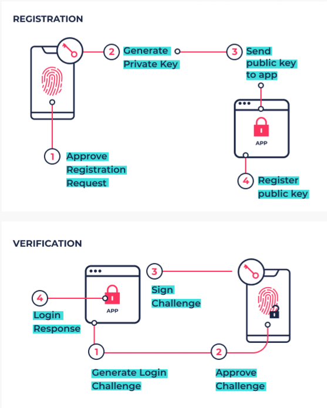

Passkeys have made strong cryptographic authentication approachable for mainstream users, but their model is largely restricted to WebAuthn logins. PassSeeds is a technical experiment that explores this question: can we hijack the same technology, user flow, and features of Passkeys to unlock broader cryptographic use cases in a way that doesn't require users to paste key material into sites/apps or own special hardware devices that can be difficult for less technical folks to use and keep track of?

## Background: How Passkeys Work Today

Passkeys are WebAuthn credentials in the form of asymmetric key pairs, typically used for replacing passwords as the way a user logs into a website. A key pair is created for a website and stored in a secure hardware module on the user's device, access-scoped to the site's origin (examples of different origins: `example.com`, `other.example.com`, `test.com`). Passkeys have two modes: device-bound passkeys that never leave the hardware module on the user's device, and syncable passkeys that platform providers replicate across a user's devices via an end-to-end encrypted syncing process (for example, iCloud Keychain and Google Password Manager). This is a basic overview of the two primary UX flows for generating and using a passkey for login, as they are designed to do:



<span class="caption" style="display:block; text-align:center; font-size:0.9em; color:#888;">
Sahil Dahekar
</span>

A standard WebAuthn authentication (`navigator.credentials.get()`) uses a passkey to sign over two things: the `authenticatorData` and `clientDataHash`, which is a SHA-256 hash of JSON containing the challenge, origin, and action type (`webauthn.get` or `webauthn.create`). The authenticator chooses an allowed algorithm (most commonly ES256 on the P-256/secp256r1 curve) and never reveals the private key. Critically, WebAuthn does not let sites request arbitrary payload signing or raw key export, except for the public key during initial creation of the passkey. That last part is critical to understand: after the initial creation of a passkey, the platform does not record the public key anywhere, and treats it effectively as a sensitive private value it does not export or expose anywhere - it is intentionally forgotten by the browser or OS that facilitated the generation of the passkey.

## The PassSeeds Concept

Passkeys provide phishing-resistant, biometric-gated use of cryptographic keys, but they are very narrowly designed for signing authentication assertions within centralized website flows. Meanwhile, most seed and key management UX remains arcane: users copy 12-24 words, stash JSON keystores, or export raw keys across apps. PassSeeds proposes a novel approach: it treats a passkey as a mechanism for deriving numerous types of cryptographic material that fuels other cryptographic actions. Instead of asking for a login assertion, the app would request a limited-purpose output (for example, a PRF value derived from the credential key or a signature over a constrained, prefixed payload) and then use that output to drive higher-level operations like encrypting, decrypting, or co-signing.

The trust boundaries stay aligned with passkeys: the private key sits in the authenticator or TEE; a PRF or derived blob can leave the authenticator only after user verification; and the host app receives outputs but never raw seed material. RP ID and origin binding still matter: they decide which PassSeed can be invoked and ensure the same anti-phishing protection that WebAuthn already enforces. Policies could key off those RP IDs to decide which actions are allowed (for example, "rpA can request PRF output for wallet actions; rpB can only request decrypt-for-self").

## Flow Sketch

**Enrollment**  
1) The app calls `navigator.credentials.create()` to mint a passkey scoped to its RP ID with `userVerification: required`.  
2) Where supported, it asks for the WebAuthn PRF extension, which ties a pseudorandom function to the credential key. The app records only public data: credential ID, display label, creation time, and policy metadata.  
3) Optionally, the app derives a seed from the PRF output and immediately wraps it with app-held or server-held encryption so the raw value never rests on the host.

**Invocation**  
1) When an action needs authorization, the app shows a summary of what will happen (for example, "sign transfer", "decrypt-for-self").  
2) It calls `navigator.credentials.get()` with `userVerification: required`, an `allowCredentials` list, and `extensions: { prf: { eval: { first: input }}}`.  
3) The authenticator verifies the origin, collects biometrics or PIN, and returns the standard assertion plus `clientExtensionResults.prf`. The app uses that PRF output as a one-time key to sign or decrypt the prepared payload, keeping the actual operation off-device or in a local enclave.

**Recovery / rotation**  
There is no passkey export. Recovery means enrolling a new PassSeed on another device and rotating dependent keys. Because PRF outputs are deterministic to a credential, migrating to a fresh credential changes derived keys. The mitigation is to support key rotation flows and re-wrapping of any long-lived ciphertexts whenever a new PassSeed is enrolled. Revocation is handled server-side by rejecting assertions from retired credential IDs.

## Threat Model and Constraints

Assumptions: the host app or page could be malicious or compromised, phishing is a primary risk, and devices can be lost or stolen. PassSeeds inherits the passkey defenses against origin spoofing because the authenticator checks RP ID and origin before releasing anything. It also inherits user-verification gating (biometric or PIN) and non-exportable private keys. It does not gain new export controls beyond what passkeys already enforce; if the authenticator returns PRF output, that output is now in host memory and must be handled carefully.

Open risks remain. Syncable credentials rely on platform cloud services; if a platform escrowed or restored keys improperly, that would weaken assurances. Attestation is optional and often filtered, so tying policies to authenticator attestation is unreliable. Downgrade paths (like falling back to passwords or non-UV WebAuthn requests) could sidestep PassSeed policies if not explicitly disallowed.

## Candidate Use Cases

Wallet-lite signing for crypto apps: use PRF output as a symmetric key that gates a server-side signer or enclave signer. The host never sees the raw seed used by the signer, and the user experiences a normal passkey prompt instead of manual seed handling.

Sealed-envelope data shares: encrypt files or messages to oneself with a key derived from a PassSeed so only the authenticator-gated flow can unwrap them. The decrypt step requires the same RP-bound credential and user verification.

Multi-party approvals: require several PassSeed prompts (one per approver) to co-sign an action. Each approver invokes their own passkey, producing PRF outputs or scoped signatures that are aggregated before the action executes.

## Implementation Notes

The WebAuthn PRF extension (built on CTAP2 hmac-secret) is the most direct building block: it returns PRF output derived from the credential key when allowed by the authenticator and the browser. A minimal call looks like this:

```javascript
const assertion = await navigator.credentials.get({
  publicKey: {
    challenge: challengeBuf,
    allowCredentials: [{ id: credId, type: 'public-key' }],
    userVerification: 'required',
    extensions: { prf: { eval: { first: payloadHash } } }
  }
});

const { prf } = assertion.getClientExtensionResults();
const seed = prf && prf.results && prf.results.first;
```

Not all authenticators or browsers support the PRF extension; the code must detect support and fail closed. Storage should remain RP-scoped: credential ID, label, creation timestamp, and allowed actions. Any audit telemetry should avoid logging PRF outputs or sensitive payloads; recording success/failure, RP ID, and action type is generally sufficient.

## Open Questions

How do we balance RP binding against reuse? RP scoping is the anti-phishing anchor, but it also boxes a PassSeed into one origin. Cross-app reuse would need explicit, multi-origin policies without weakening origin checks.

Will platform authenticators expose the necessary extensions consistently? The PRF extension exists, but availability and UX differ across iOS, Android, desktop OSes, and hardware keys. Custom extensions for arbitrary signing are unlikely without breaking WebAuthn’s safety model.

What is the fallback when PRF is unsupported? Without it, PassSeeds would need a different on-device wrapper (for example, platform secure enclave APIs) and a native bridge, which reduces reach.

## Next Steps

Prototype a browser demo that uses the PRF extension with a test RP, then drives a local encrypt/decrypt and a server-side delegated signer using the derived output.

Run a focused threat model on the handshake: malicious host, replay of PRF inputs, downgrade to non-UV, syncable credential theft, and log/telemetry leakage.

Usability-test the prompt text and recovery flow with a handful of users to confirm the passkey UX maps cleanly to non-login actions without causing confusion.
