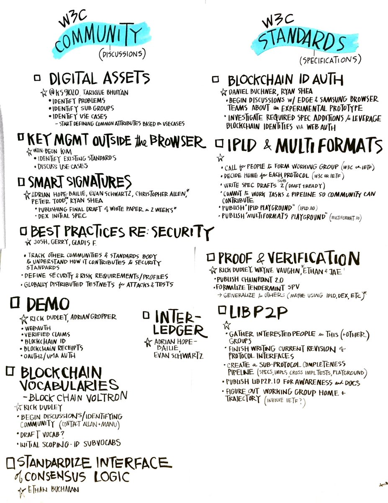

I had the opportunity to both co-chair and present at the [W3C's blockchain workshop](https://www.w3.org/2016/04/blockchain-workshop/) at MIT in Boston this week. More than 100 of the best and brightest from the standards and blockchain worlds met to discuss potential Web standards opportunities for blockchain tech. I have been working toward the establishment of a large-scale, user-sovereign, blockchain identity system for many years, and with an initiative now underway at Microsoft, this event was instrumental in better understanding the views of other organizations we intend to work with in bringing this system to users, companies, and governments across the globe.

There were many areas of standardization discussed that touched on blockchain-based identity systems, but perhaps the most specific, actionable area of standardization the group identified was extension of the existing [Web Auth spec](https://www.w3.org/TR/2016/WD-webauthn-20160531/) to include the APIs, features, and flows necessary to enable blockchain-based identity authentication in browsers. This is something I will begin to explore with other implementers and interested organizations from the W3C workshop who committed to do so with us. The workshop was a great opportunity to start an important discussion about systems that could move the Web far beyond what it is today. I look forward to reporting back on the progress of our explorations as we move forward!